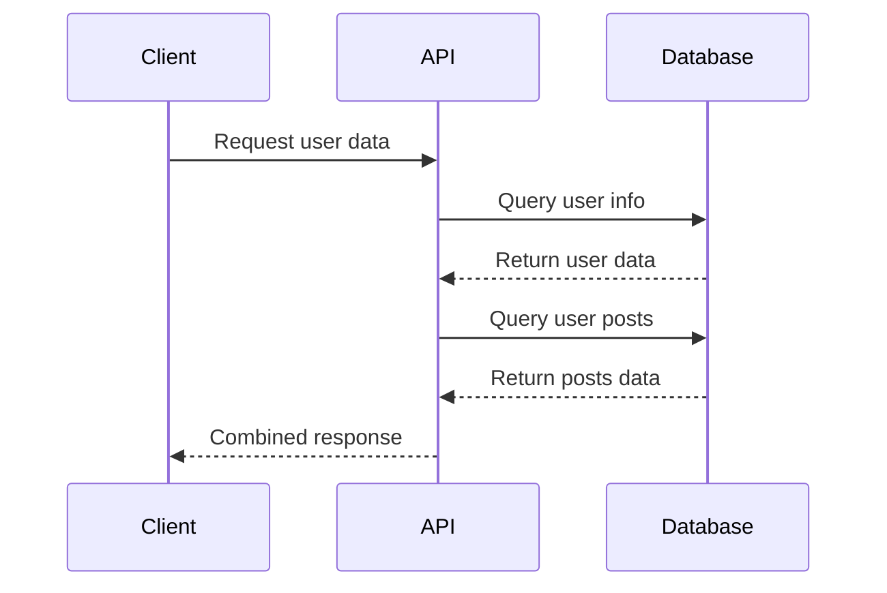

## Introduction to Async/Await

Async/await is a modern JavaScript feature that simplifies working with asynchronous code. This tutorial covers:

- How **async/await** works behind the scenes
- Converting *Promise chains* to async/await
- Best practices for `error handling`
- Real-world application examples

## Code Example

```javascript
async function fetchUserData(userId) {
  try {
    // Fetch user details
    const userResponse = await fetch(`/api/users/${userId}`);
    const userData = await userResponse.json();
    
    // Fetch user posts
    const postsResponse = await fetch(`/api/users/${userId}/posts`);
    const postsData = await postsResponse.json();
    
    // Return combined data
    return {
      user: userData,
      posts: postsData
    };
  } catch (error) {
    console.error('Failed to fetch user data:', error);
    throw error;
  }
}

// Usage
fetchUserData(123)
  .then(data => console.log(data))
  .catch(err => console.error('Error in main flow:', err));
```

## Flow Diagram



## Common Pitfalls

| Mistake | Impact | Solution |
|---------|--------|----------|
| **Forgetting await** | Promise objects returned instead of resolved values | Always await Promises when using async functions |
| *Unnecessary nesting* | Callback hell despite using async/await | Keep code flat with proper try/catch blocks |
| `Missing error handling` | Uncaught Promise rejections | Use try/catch or .catch() on async functions |

## Step-by-Step Learning Path

1. Understanding Promises
   - Promise states
   - .then() and .catch() methods
   
2. Introducing Async/Await
   - Async function declaration
   - Await operator usage
   
3. Advanced Techniques
   - Parallel execution with Promise.all()
   - Sequential vs concurrent execution

> Remember: Async functions always return Promises, even when you return a simple value.

## Conclusion

Async/await provides a more readable and maintainable approach to asynchronous programming in JavaScript. Practice these patterns to improve your code quality.

### 练习题

试着将下面的Promise链转换为async/await语法：

```javascript
function getUserData(userId) {
  return fetch(`/api/users/${userId}`)
    .then(response => response.json())
    .then(user => {
      return fetch(`/api/users/${userId}/posts`)
        .then(response => response.json())
        .then(posts => {
          return { user, posts };
        });
    })
    .catch(error => {
      console.error("Error fetching data:", error);
      throw error;
    });
}
```