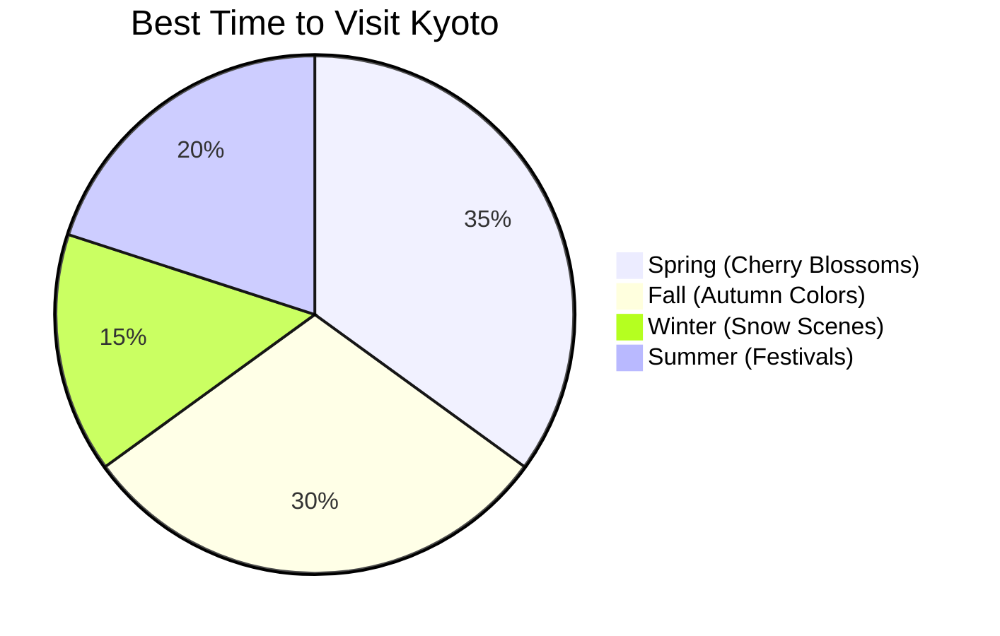

## Exploring Kyoto: A 7-Day Itinerary

Kyoto, the cultural heart of Japan, offers a perfect blend of **ancient traditions** and *modern conveniences*. This guide provides:

- Detailed day-by-day itinerary
- Transportation tips using `Japan Rail Pass`
- Seasonal recommendations
- Budget accommodation options

## Recommended Itinerary

```typescript
interface DayPlan {
  day: number;
  morning: string;
  afternoon: string;
  evening: string;
  dining: string[];
  notes: string;
}

const kyotoItinerary: DayPlan[] = [
  {
    day: 1,
    morning: "Arrive at Kyoto Station",
    afternoon: "Fushimi Inari Shrine",
    evening: "Gion District Walk",
    dining: ["Ippudo Ramen", "Street Food at Nishiki Market"],
    notes: "Purchase a 1-day bus pass for ¥600"
  },
  {
    day: 2,
    morning: "Kinkaku-ji (Golden Pavilion)",
    afternoon: "Ryoan-ji Zen Garden",
    evening: "Arashiyama Bamboo Grove",
    dining: ["Traditional tofu at Shoraian", "Matcha desserts"],
    notes: "Rent bicycles for ¥1000/day"
  }
  // More days would follow...
];
```

## Seasonal Highlights



## Transportation Guide

| Method | Cost | Convenience | Best For |
|--------|------|-------------|----------|
| **City Bus** | ¥230 per ride or ¥600 day pass | Medium | City center attractions |
| *Subway* | ¥210-¥340 per ride | High | Longer distances, avoiding traffic |
| `JR Train` | Covered by JR Pass | Medium | Trips to Arashiyama, Fushimi |
| Bicycle | ¥1000/day rental | High | Exploring flat eastern areas |

## Temple Etiquette

1. Dress Code
   - Modest clothing covering shoulders and knees
   - Comfortable shoes that can be easily removed
   
2. Photography
   - Many indoor areas prohibit photos
   - Always check for signs before taking pictures
   
3. Shrine Visits
   - Wash hands at purification fountains
   - Bow slightly when entering sacred spaces

> Tip: Purchase a temple stamp book (御朱印帳, goshuin-chō) to collect unique calligraphy stamps at each temple you visit.

## Must-Try Local Specialties

- **Yudofu** - Hot tofu dishes
- *Kaiseki* - Traditional multi-course meals
- `Wagashi` - Japanese sweets perfect with matcha
- Yatsuhashi - Cinnamon mochi confections

## Conclusion

Kyoto rewards slow travel and mindful exploration. Allow yourself to get lost in its ancient streets and discover hidden gems not listed in guidebooks.

### 行程规划表

| 日期 | 上午 | 下午 | 晚上 |
|------|------|------|------|
| 4月1日 | 伏见稻荷大社 | 清水寺 | 祇园散步 |
| 4月2日 | 金阁寺 | 龙安寺 | 岚山竹林 |
| 4月3日 | 二条城 | 锦市场 | 鸭川河畔 |